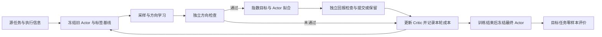

# 固定本地信息下的多智能体策略改进

研究严格单源 CTDE 条件下，怎样从团队经验学习本地策略改进方向，将方向实现为共享 Actor，并检验冻结 Actor 的跨规模表现。

## 一条研究主线

这是新方案中主方法的目标流程，对应实现尚待验收；详细阶段与失败分支由[实验方案第 3 节](docs/策略流形研究设计.实验方案.md#3-算法定义)定义。MAPPO/IPPO 使用独立的 PPO 更新后端，在相同任务、执行信息和评价条件下比较。

证据沿这条流程逐层建立：方向是否准确、Actor 是否实现了改善、源训练是否值得其成本、同一方向能否在满足条件时运输、最终 Actor 是否具有零样本优势。前一层的正结果不能代替后一层的实验。

## 三个环境的分工

| 环境 | 在同一研究中的作用 | 当前实现边界 |
|---|---|---|
| [成对协作](experiments/pair_coordination/README.md) | 用精确量解释方向、拟合、检查和条件运输 | 已有一步实现；新冲突族与多步模型需实现和验收 |
| [合作导航](experiments/cooperative_navigation/README.md) | 在多步覆盖任务中检验机制、源学习与冻结部署 | 已有原协议代码；全目标信息协议与跨规模理论定位未冻结 |
| [RWARE](experiments/rware/README.md) | 检验稀疏交付、资源竞争与固定负载增减员 | 设计阶段，尚无完整封装与训练实现 |

三个环境应使用同一套已声明的算法定义、实验生命周期和证据规则，环境差异由任务和数据接口表达。成对环境保留独立精确核验；导航和仓库各自审查理论前提。固定输入维度不保证覆盖，现有理论也不保证最终策略普遍优于 PPO。

## 设计与实现的对应入口

| 要回答的问题 | 唯一维护入口 |
|---|---|
| 数学上研究什么、需要什么条件？ | [理论主稿](docs/策略流形研究设计.CTDE本地策略改进版.md) |
| 每个环境检验什么、怎样比较？ | [完整实验方案](docs/策略流形研究设计.实验方案.md) |
| 模块怎样协作、怎样逐步重构？ | [总体架构与实现规范](docs/项目总体架构.md) |
| 当前阶段下一项工作是什么？ | [实验方案第 12 节](docs/策略流形研究设计.实验方案.md#12-实施顺序和验收清单) |
| 现在的代码和命令实际支持什么？ | [实验目录及环境说明](experiments/README.md) |

研究定义由总方案维护；代码职责和迁移规则由架构规范维护；环境文档说明真实接口。运行参数最终以验收后的有效配置为准。完整索引见[文档导航](docs/README.md)。

## 当前重构起点

现有代码仍以两套环境训练器组织，任务模式、更新、恢复和输出之间存在交叉依赖。总体架构已经明确，但代码尚未完成迁移。近期按以下次序收敛：

1. 明确任务、采样、冻结策略和运行记录的接口；核验现有成对实现的行为与精确结果。
2. 用成对环境走通从配置解析到机制报告的完整流程，再实现新冲突族与多步诊断。
3. 导航完成自己的理论与信息协议审查后接入；随后实现仓库适配。

结构迁移与算法修改分别验收：前者核对行为等价，后者登记新定义并提供独立证据。已有数学脚本和测试继续用于复核；旧结果的保留边界见实验目录。
