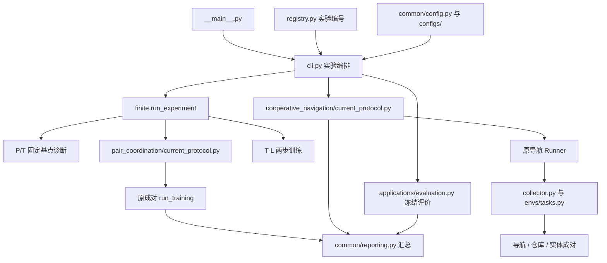

# 项目结构与代码说明

更新：2026-09-24。本文依据清理后的实际代码，说明目录职责、执行流程、配置关系和修改位置。理论定义见[CTDE 主稿](策略流形研究设计.CTDE本地策略改进版.md)，实验任务见[总体实验方案](总体实验方案.md)，完整启动命令见[实验运行说明](../experiments/README.md)。

## 1. 项目在做什么

项目研究：在一个源规模中，用团队经验学习本地动作概率的改进方向，再拟合共享 Actor，并检验人数变化后的冻结执行与表现。代码同时提供可精确计算的小模型和原生导航、仓库任务。

实际训练主体仍是原成对和导航训练器。统一入口负责选实验、读配置、调训练器及汇总；实体网络和任务适配是为当前实验增加的必要部分。代码能接受不同人数，不代表观测无损、源经验覆盖充分或零样本迁移一定成功。

## 2. 从仓库根目录往下看

命令默认在仓库根目录运行；本机为 `D:\manifold`，其中 `manifold_project` 是 Python 包。

```text
仓库根目录/
├─ manifold_project/
│  ├─ README.md                     项目入口与阅读顺序
│  ├─ docs/                         理论、实验设计、结构说明和问题记录
│  ├─ experiments/                  实验代码、配置与统一测试
│  │  ├─ __main__.py                python -m 的启动入口
│  │  ├─ cli.py                     实验编排
│  │  ├─ registry.py                实验编号及依赖关系
│  │  ├─ configs/                   当前论文矩阵配置
│  │  ├─ common/                    配置、运行信息、统计和图表
│  │  ├─ pair_coordination/         原成对环境与训练主体
│  │  ├─ cooperative_navigation/    原导航环境与共用应用训练主体
│  │  ├─ applications/              任务观测适配与冻结评价
│  │  ├─ finite/                    当前 P/T 机制诊断与两步模型
│  │  ├─ tests/                     唯一工程测试目录
│  │  ├─ visualize.py               当前矩阵模型的任务 GIF
│  │  └─ reuse_audit.csv             原文件的保留、移动、合并和移除记录
│  └─ tools/                        文稿公式提取与独立数学核验
├─ references/                      论文原文和文献索引
├─ archive/                         原始旧实验和停用框架快照
└─ .venv/                           本机 Python 环境，不是项目源码
```

`results/` 在运行时按 `--output` 创建，不是必须预先存在的源码目录。`build/`、`__pycache__/`、`.pytest_cache/` 是生成物；原始归档不参与日常训练加载。

## 3. 各层如何连接



这里有三个容易误解的地方：

1. **`cooperative_navigation` 不只训练导航。** 为直接复用旧代码，应用训练器仍放在这个目录。仓库和 P-TB 通过任务接口接入同一个 `Runner`。
2. **`applications` 没有另一套算法。** 它提供统一观测字典和冻结评价；重复的 `training.py`、`models.py` 已删除。
3. **`finite` 和 `pair_coordination` 职责不同。** 前者组织当前机制诊断和两步模型；P-L 多轮训练转交后者，方向及 Actor 的基础拟合也复用后者。

## 4. 入口、实验编号与公共支撑

| 职责 | 对应代码 | 具体工作 |
|---|---|---|
| 启动 | [__main__.py](../experiments/__main__.py) | 调用 CLI，支持 `python -m manifold_project.experiments` |
| 运行环境初始化 | [experiments/__init__.py](../experiments/__init__.py)、[runtime.py](../experiments/common/runtime.py) | 导入前运行库设置、设备和确定性配置、依赖版本与代码指纹 |
| 实验目录 | [registry.py](../experiments/registry.py) | 登记 P/T/N/W 编号、环境、方法及源实验依赖；它不实现训练 |
| 执行编排 | [cli.py](../experiments/cli.py) 的 `resolve`、`_run_finite`、`_run_train`、`main` | 展开种子和方法、先训练后评价、检查输入、记录运行清单 |
| 配置读取 | [common/config.py](../experiments/common/config.py) | 合并配置并验证键名、取值和源规模等约束 |
| 数据汇总 | [common/reporting.py](../experiments/common/reporting.py) | CSV/JSON、跨种子汇总、配对比较与报告 |
| 统计 | [common/statistics.py](../experiments/common/statistics.py) | 从原成对模块保留的 bootstrap 和 Wilson 区间 |
| 图像 | [common/plotting.py](../experiments/common/plotting.py) | 当前矩阵总图；训练期间覆盖更新，不逐轮生成文件 |

安装入口是 [experiments/requirements.txt](../experiments/requirements.txt)，工程测试另用 [requirements-test.txt](../experiments/requirements-test.txt)。环境目录内保留的 requirements 文件服务于底层入口；日常运行当前矩阵优先使用公共依赖清单，具体环境配置命令见实验 README。

以下是代码路由，不代替总体方案中的实验设计：

| 实验 | 实际执行位置 |
|---|---|
| P-E、P-A、P-T、P-I、P-B、T-V | [finite/diagnostics.py](../experiments/finite/diagnostics.py) |
| P-L | `finite/training.py → pair_coordination/current_protocol.py → training/runner.py` |
| T-L | [finite/training.py](../experiments/finite/training.py) 的两步训练分支 |
| N-C、N-I、N-R、N-Gd、N-Gr、W-C、P-TB | `cli.py → cooperative_navigation/current_protocol.py → training/runner.py`；输入/结构消融和 P-TB 还安排冻结评价 |
| N-T、N-D、W-T、W-L | [applications/evaluation.py](../experiments/applications/evaluation.py) 的 `evaluate_checkpoint` |
| N-F、W-F | 源训练中的 [FitProbe](../experiments/cooperative_navigation/evaluation/fit_probe.py) 产生固定方向拟合诊断；CLI 读取源诊断文件汇总 |

方法名在当前矩阵中为 AN、SA、DA、MAPPO-E、IPPO-E，应用适配器分别映射到原训练器的 `ours`、`sampled`、`direct`、`mappo`、`ippo`。P-I 当前只完成精确输入映射分解，同数据学习对照仍待补充。

## 5. 成对协作模块：环境、模型和原训练器

目录：[pair_coordination/](../experiments/pair_coordination)。

| 层级与文件 | 功能 |
|---|---|
| [envs/pair_coordination.py](../experiments/pair_coordination/envs/pair_coordination.py) | `PairConfig`、一步团队奖励、联合采样和回合生命周期 |
| [models/actor.py](../experiments/pair_coordination/models/actor.py)、[direction.py](../experiments/pair_coordination/models/direction.py)、[critic.py](../experiments/pair_coordination/models/critic.py) | 按本地类型索引的表格 Actor、方向和基线 |
| [models/mlp.py](../experiments/pair_coordination/models/mlp.py)、[torch_models.py](../experiments/pair_coordination/models/torch_models.py) | 原 MLP、模型序列化与 PyTorch 执行适配；表格训练也可经 `TorchModel` 执行 |
| [current_protocol.py](../experiments/pair_coordination/current_protocol.py) | 设置当前 P-L 源参数、初始策略、方法、经验检查和源监控，然后调用旧训练器 |
| [training/runner.py](../experiments/pair_coordination/training/runner.py) 的 `run_training` | 采样、冻结、方向学习、拟合、检查、提交轮次和保存的主循环 |
| [training/config.py](../experiments/pair_coordination/training/config.py)、[plan.py](../experiments/pair_coordination/training/plan.py)、[descriptions.py](../experiments/pair_coordination/training/descriptions.py) | 底层参数、预算估算、命令别名和参数说明 |
| [training/labels.py](../experiments/pair_coordination/training/labels.py) | 用冻结基线生成标签 |
| [training/direction_loss.py](../experiments/pair_coordination/training/direction_loss.py)、[actor_fit.py](../experiments/pair_coordination/training/actor_fit.py) | AN/SA 方向目标和前向 KL 拟合；按模型类型调用对应实现 |
| [training/torch_fit.py](../experiments/pair_coordination/training/torch_fit.py)、[optim.py](../experiments/pair_coordination/training/optim.py) | PyTorch 拟合及有限数组 Adam；不同后端共用同一数学目标 |
| [training/policy_gradient.py](../experiments/pair_coordination/training/policy_gradient.py)、[acceptance.py](../experiments/pair_coordination/training/acceptance.py) | 原 PG、DA 比率代理与独立检查规则 |
| [training/batching.py](../experiments/pair_coordination/training/batching.py)、[logging.py](../experiments/pair_coordination/training/logging.py)、[progress.py](../experiments/pair_coordination/training/progress.py) | 小批次、分用途采样计费、事件账本和进度 |
| [training/checkpoints.py](../experiments/pair_coordination/training/checkpoints.py) | 原子写入、final/best 和轮次恢复状态 |
| [evaluation/exact_pair.py](../experiments/pair_coordination/evaluation/exact_pair.py) | 枚举/闭式真值、方向及指数目标诊断 |
| [analysis/plot_training.py](../experiments/pair_coordination/analysis/plot_training.py)、[round_overview.py](../experiments/pair_coordination/analysis/round_overview.py) | 底层成对训练记录的总图 |
| [train.py](../experiments/pair_coordination/train.py)、[evaluate.py](../experiments/pair_coordination/evaluate.py) | 保留的单次训练、恢复与精确评价入口；不等同于当前实验矩阵 |

P-L 使用独立源样本选择 best；底层旧配置仍可能用精确真值选 best，因此两套配置不能直接混用。原 P-M 等套件驱动、嵌套 `experiments/`、历史套件 JSON 和历史报告脚本已经退出活动目录。

## 6. 导航与共用应用训练模块

目录：[cooperative_navigation/](../experiments/cooperative_navigation)。

### 6.1 环境、观测与模型

| 对应代码 | 功能与数据 |
|---|---|
| [envs/navigation.py](../experiments/cooperative_navigation/envs/navigation.py) | 原生 MPE2 动力学/奖励封装，提供观测、集中状态及首次同时覆盖/期限结束判断 |
| [envs/tasks.py](../experiments/cooperative_navigation/envs/tasks.py) | 按任务选择环境；将仓库/P-TB 的观测打包成旧采样器可读的形式 |
| [observations/history.py](../experiments/cooperative_navigation/observations/history.py) | 承载观测、上次动作、有效位和时钟；当前实体协议固定 `history=1` |
| [models/__init__.py](../experiments/cooperative_navigation/models/__init__.py) | 实际训练用 `Actor`、`Direction`、`Critic`、`LocalCritic` 和模型加载；`entity_input` 将采样器张量拆回实体字段 |
| [models/entities.py](../experiments/cooperative_navigation/models/entities.py) | `EntityEncoder`、`RelationAttention`、`TypedActionReadout`：编码实体、关系交互、按类型汇聚动作信息 |
| [models/deployment.py](../experiments/cooperative_navigation/models/deployment.py) | 让原训练器 Actor 接受当前评价接口的观测字典；保持训练时的字段排列 |

实体字典有 `self`、`entities`、`mask`：自身字段宽度和每条实体记录宽度固定，实体条数可变。当前三类任务的 `(自身宽度, 实体记录宽度, 动作数)` 分别为导航 `(5,6,5)`、仓库 `(9,11,5)`、P-TB `(3,6,2)`，在 [runner_config](../experiments/cooperative_navigation/current_protocol.py) 中映射。

当前 Actor/方向网络使用当前帧和剩余时间；旧 History 运输的上次动作和帧有效位不进入该实体网络。导航使用完整原生实体列表；仓库仍只有原生局部传感范围。`mask` 用于排除无效记录，不是动作屏蔽。中央 Critic 使用全局状态，IPPO Critic 使用本地输入；冻结目标评价不运行 Critic。

### 6.2 训练与算法

| 对应代码 | 功能 |
|---|---|
| [current_protocol.py](../experiments/cooperative_navigation/current_protocol.py) 的 `runner_config`、`train` | 把矩阵参数映射给旧 Runner，预留监控预算、安装诊断回调、汇总训练记录 |
| [training/runner.py](../experiments/cooperative_navigation/training/runner.py) 的 `Runner` | 源训练主循环、标签、参数更新、双检查、回溯、计费、监控、检查点及恢复 |
| [training/collector.py](../experiments/cooperative_navigation/training/collector.py) | 完整回合采样、旧概率快照、终止/超时字段、有效样本和分用途成本 |
| [training/ppo.py](../experiments/cooperative_navigation/training/ppo.py) | 回报、GAE、价值标签、折扣/有效样本权重、方向项及底层本地 PPO 目标 |
| [training/author_ppo.py](../experiments/cooperative_navigation/training/author_ppo.py) | 作者 PPO 的参数、样本打包、更新、ValueNorm 和状态适配；当前 MAPPO/IPPO 经这里调用作者更新 |
| [training/entity_policy.py](../experiments/cooperative_navigation/training/entity_policy.py) | 为作者更新器提供共同实体 Actor 和集中/本地 Critic 接口 |
| [vendor/mappo/](../experiments/cooperative_navigation/vendor/mappo) | 固定来源的第三方实现；版本和来源见 [UPSTREAM.json](../experiments/cooperative_navigation/vendor/mappo/UPSTREAM.json)，许可证随包保留 |
| [training/storage.py](../experiments/cooperative_navigation/training/storage.py) | 原子存储、事件写入及分用途种子；公共报告直接复用其中原子写入函数 |

AN/SA 一轮的顺序是：冻结旧 Actor/Critic → 采源回合并计算固定标签 → 训练 Critic 和方向 → 独立方向检查 → 从旧 Actor 副本拟合指数目标 → 独立回报检查及必要回溯 → 提交轮次、监控和保存。方向在每轮重新初始化；这不是方向网络的软更新。SA 与 AN 的关键差别在方向损失的二次项。

DA 跳过方向网络，优化旧策略比率代理后做回报检查。MAPPO/IPPO 使用作者 PPO 更新，不执行 AN 的方向检查和 Actor 目标拟合。流程分支在同一个原 Runner 内，不另设通用训练器。

### 6.3 监控与底层工具

| 对应代码 | 使用范围 |
|---|---|
| [evaluation/evaluate.py](../experiments/cooperative_navigation/evaluation/evaluate.py) | 原 Runner 的源监控与任务指标 |
| [evaluation/fit_probe.py](../experiments/cooperative_navigation/evaluation/fit_probe.py) | 固定同一方向、旧 Actor 和目标，改变拟合步数；另行计费，不替换训练 Actor |
| [evaluation/monitoring.py](../experiments/cooperative_navigation/evaluation/monitoring.py)、[plotting.py](../experiments/cooperative_navigation/evaluation/plotting.py)、[reporting.py](../experiments/cooperative_navigation/evaluation/reporting.py) | 原套件事件读取、逐轮指标、实时图和统计 |
| [evaluation/transfer.py](../experiments/cooperative_navigation/evaluation/transfer.py) | 原套件格式的冻结迁移与审查 |
| [run_experiments.py](../experiments/cooperative_navigation/run_experiments.py)、[analyze.py](../experiments/cooperative_navigation/analyze.py) | 原套件格式入口、恢复和结果分析 |
| [tools/monitor.py](../experiments/cooperative_navigation/tools/monitor.py)、[replay.py](../experiments/cooperative_navigation/tools/replay.py)、[stability.py](../experiments/cooperative_navigation/tools/stability.py) | 原套件监控、GIF 和源曲线稳定性描述；稳定性描述不是收敛证明 |

原套件的 `manifest.jobs` 与当前矩阵的 `manifest.experiments` 不同。工具位置靠近原训练器，是因为它们读取原格式，不能把任意矩阵结果目录直接交给它们。

## 7. 任务适配和冻结评价

目录：[applications/](../experiments/applications)。

| 对应代码 | 负责什么 |
|---|---|
| [envs/__init__.py](../experiments/applications/envs/__init__.py) 的 `make_env` | 按任务名创建具有共同字典接口的环境 |
| [envs/navigation.py](../experiments/applications/envs/navigation.py) | 基于原导航封装转换观测和指标；不另写导航动力学 |
| [envs/warehouse.py](../experiments/applications/envs/warehouse.py) | 原生 RWARE 固定地图、局部传感字段、交付及拥堵指标 |
| [envs/pair_entities.py](../experiments/applications/envs/pair_entities.py) | 完整名单的一步成对任务，用于 P-TB；不同于只输入自身类型的 P-L 表格模型 |
| [evaluation.py](../experiments/applications/evaluation.py) | 读取当前 final Actor、按预定场景种子评价源/目标规模、核对冻结参数、保存回合指标 |
| [../visualize.py](../experiments/visualize.py) | 使用同一冻结加载路径生成导航/仓库 GIF |

仓库没有独立的 `warehouse/training` 目录：环境适配在这里，训练在原导航 Runner，矩阵配置在 `configs/warehouse.json`。P-TB 同理。

## 8. 有限机制与两步任务

目录：[finite/](../experiments/finite)。

| 对应代码 | 功能 |
|---|---|
| [__init__.py](../experiments/finite/__init__.py) 的 `run_experiment` | P/T 实验分发和结果接口 |
| [environments.py](../experiments/finite/environments.py) | `PairGame`、`TwoStepGame`、采样、枚举、闭式量和标签 |
| [diagnostics.py](../experiments/finite/diagnostics.py) | 估计、Actor 实现、条件迁移、信息损失、边界及轨迹方差实验 |
| [numerics.py](../experiments/finite/numerics.py) | 指数目标、KL、方向拟合与 Actor 拟合；基础优化直接调用旧成对函数，受限 Actor 和时间轴另作适配 |
| [objectives.py](../experiments/finite/objectives.py)、[acceptance.py](../experiments/finite/acceptance.py) | 多时间步的目标计算、经验检查与有限边界诊断 |
| [training.py](../experiments/finite/training.py) | P-L 转交旧成对训练器；T-L 运行两步训练、监控及冻结报告 |

固定基点实验控制的是样本数、数据重复和拟合步数，不以多轮训练预算决定全部计算量。T-L 的完整回合有两步，不能用一步成对循环代替。精确优势/真值用于标明的诊断，不作为应用任务中可获得的标签。

## 9. 配置从哪里来，调参改哪里

当前矩阵的常规合并顺序为：

```text
configs/defaults.json
→ configs/<环境>.json
→ configs/profiles.json 的 common 与 finite/application 部分
→ --config 指定的 JSON
→ CLI 的显式参数与实验专属设置
→ current_protocol.py 映射后的底层配置
```

`cli.resolve` 还会固定消融开关，并对 smoke 的任务期限和采样量作工程缩减。因此最终值应以 `--dry-run` 和运行内保存的配置为准，不能只读一个 JSON 推断。

| 需求 | 首选位置 |
|---|---|
| 修改所有当前实验共享默认值 | [configs/defaults.json](../experiments/configs/defaults.json) |
| 修改导航/仓库/成对的矩阵设置 | [configs/navigation.json](../experiments/configs/navigation.json)、[warehouse.json](../experiments/configs/warehouse.json)、[pair.json](../experiments/configs/pair.json)、[pair_entities.json](../experiments/configs/pair_entities.json)、[two_step.json](../experiments/configs/two_step.json) |
| 修改 pilot/formal 默认预算或种子 | [configs/profiles.json](../experiments/configs/profiles.json)；单次运行也可用 CLI 覆盖 |
| 修改某次对照、学习率或拟合预算 | 用 `--config` 提供已支持键的覆盖文件，并先 `--dry-run` |
| 修改旧导航底层默认值/校验 | [cooperative_navigation/configs.py](../experiments/cooperative_navigation/configs.py) 和 [configs/](../experiments/cooperative_navigation/configs)；矩阵传入值仍由 `runner_config` 覆盖 |
| 修改单次成对训练参数 | [TrainConfig](../experiments/pair_coordination/training/config.py) 和 [底层 configs/](../experiments/pair_coordination/configs)；当前 P-L 仍由其 `current_protocol.py` 设置 |

应用矩阵中的 `direction_steps/actor_fit_steps/critic_steps` 当前映射为旧训练器的 **epoch 数**；P/T 固定基点的 `fit_steps` 表示优化步数。环境步、回合、epoch 和 round 是不同计数，真实优化次数与源成本看日志。

## 10. 保存、评价和恢复的边界

| 文件/位置 | 内容与用途 |
|---|---|
| 套件 `manifest.json` | 配置、方法、种子、来源、运行状态和 checkpoint 路径 |
| `summary.csv`、`analysis.md` | 实验汇总和解释边界 |
| `training.csv`、`diagnostics.csv`、`evaluation_episodes.csv` | 训练过程、机制诊断和纯报告回合记录；按实验类型生成 |
| `overview.png` | 当前矩阵总图，训练中可覆盖更新 |
| 每个底层训练运行 `events.jsonl` | 单个事件账本，记录采样、检查和轮次提交；不是每轮一个 JSONL |
| P-L `checkpoints/final.json、best.json` | 原成对格式，含训练配置及恢复字段；当前协议按独立源监控选 best |
| 应用 `checkpoints/final.pt、best.pt` | final 含模型、优化器、随机状态和计费等恢复信息；best 是源监控挑选的 Actor 快照，不能当成完整恢复点 |
| T-L `final.npz、best_source.npz` | 有限 Actor 参数；不是完整续训状态 |

主比较采用 final。应用 best 的评分在 `Runner.evaluate_node` 中定义：导航优先源成功率，再比较完成步数和碰撞；不应笼统解释为所有任务都按源回报选择。

当前矩阵没有自动续训开关；原成对单次入口及导航原套件入口保留对应恢复功能。原套件与矩阵的外层清单不同，不宜仅替换目录就套用恢复命令。新旧观测结构或终止协议不同的 checkpoint 也不能直接续训。

训练、方向检查、旧/新回报检查和源选模监控计入当前源预算；纯报告评价与固定方向拟合诊断另行计费。目标评价加载冻结 Actor，不训练目标 Critic，不按目标成绩选 checkpoint。

## 11. 测试、数学核验和文档维护

工程测试统一在 [experiments/tests/](../experiments/tests)，目前为 13 个文件、102 项检查。这个数量是当前版本的记录，不是后续必须凑齐的指标。

| 检查内容 | 对应文件 |
|---|---|
| 配置、入口、统计与真实环境编排 | [test_cli.py](../experiments/tests/test_cli.py)、[test_native_cli.py](../experiments/tests/test_native_cli.py) |
| 实体权限、mask、变人数和原生环境 | [test_entities_envs.py](../experiments/tests/test_entities_envs.py) |
| 应用方法、CUDA、恢复、诊断独立性、冻结回放及作者源码 | [test_restored_backend.py](../experiments/tests/test_restored_backend.py) |
| 当前 P/T 和导航数学 | [test_finite.py](../experiments/tests/test_finite.py)、[test_navigation_math.py](../experiments/tests/test_navigation_math.py) |
| 保留的成对环境、梯度与执行后端 | [test_pair_environment.py](../experiments/tests/test_pair_environment.py)、[test_pair_learning.py](../experiments/tests/test_pair_learning.py)、[test_pair_backend.py](../experiments/tests/test_pair_backend.py) |
| 原子写入、断点与底层入口 | [test_pair_atomic.py](../experiments/tests/test_pair_atomic.py)、[test_pair_checkpoint.py](../experiments/tests/test_pair_checkpoint.py)、[test_pair_entrypoint.py](../experiments/tests/test_pair_entrypoint.py) |
| 总图输出 | [test_plotting.py](../experiments/tests/test_plotting.py) |

独立数学核验位于 [tools/verification/](../tools/verification)：`check_ctde_local_policy.py` 检查有限 CTDE 关系，`check_ctde_extensions.py` 在此基础上检查扩展量，`check_cross_scale_foundations.py` 给出跨规模正反例。它们不训练模型。[extract_math_check.py](../tools/extract_math_check.py) 用于提取文稿公式，按需生成 TeX；也不参与训练。

### 常见修改的定位

| 想修改什么 | 从哪里开始 |
|---|---|
| 实验编号、方法组合、源实验依赖 | `registry.py`；执行行为还要看 `cli.py` |
| 观测字段、可见范围、奖励或终止 | 相应任务环境封装；同时核对 `envs/tasks.py`、`entity_input`、部署转换及环境测试 |
| 实体编码、关系交互、按类型读取 | `cooperative_navigation/models/entities.py` |
| AN/SA 损失或 Actor 拟合 | 应用看 `training/runner.py` 和 `ppo.py`；成对看 `direction_loss.py`、`actor_fit.py`、`torch_fit.py` |
| PPO 超参数和样本打包 | `current_protocol.py`、`training/author_ppo.py`；实体模型接口看 `entity_policy.py` |
| 检查阈值、预算或恢复 | 各环境 `training/runner.py` 及保存/采样模块；参数映射也要同步 |
| 目标人数、冻结评价与 GIF | 矩阵环境配置、`applications/evaluation.py`、`visualize.py` |
| CSV 字段、汇总和图像 | `common/reporting.py`、`common/plotting.py`；原套件格式看环境内部报告模块 |
| 理论、实验设计、命令或结构说明 | 分别更新主稿、总体方案、实验 README、本文；其他文档只维护链接和必要摘要 |

当前研究进度统一见[开发路线](研究主张与开发路线.md)。代码通路与工程检查通过，不等于正式预算训练完成，也不构成收敛或零样本优势的证据。
