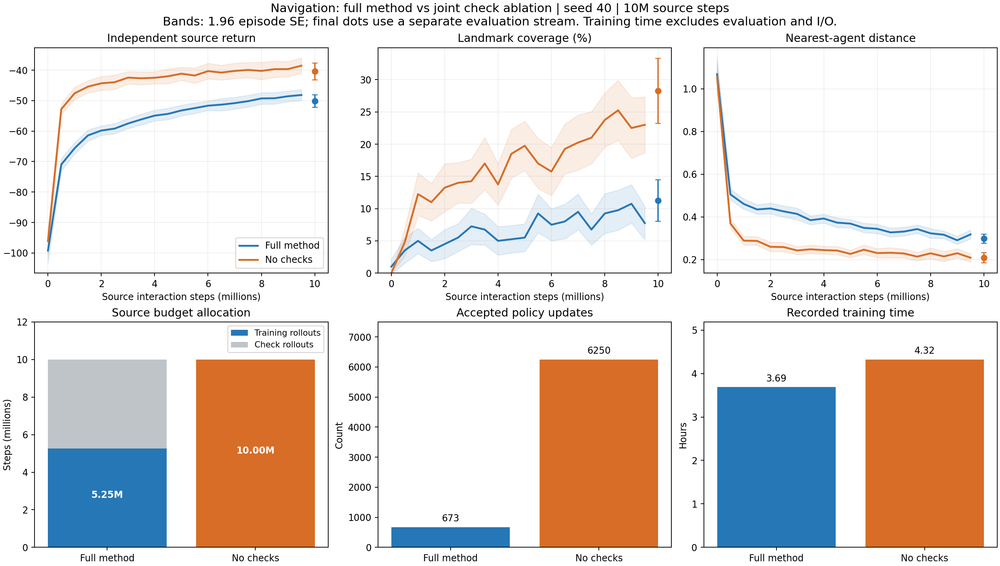

# nav_04：双检查消融与完整方法对照

更新：2026-09-19。数据为 nav_03_pilot 的 ours 与 nav_04_pilot 的 no_checks，均为种子40、CUDA、1000万源团队步。本文是单种子开发诊断，不能作为正式算法排名或零样本迁移结论。

## 1. 当前判断

双检查消融更早进入回报增速放缓阶段，但相对完整方法的回报、覆盖和距离均更好；“性能较差”适用于任务完成水平仍低，不适用于本次与完整方法的相对比较。当前证据也不能确认已经稳定收敛。



图中实线连接非final的固定评价网格，误差带为回合标准误的1.96倍；final使用另一评价随机流，以独立点显示。误差带不表示训练种子间的不确定性，也不构成显著性检验。AUC按项目既定的左端点积分计算。

| 指标 | 完整方法 nav_03 | 双检查消融 nav_04 | 解释 |
|---|---:|---:|---|
| final 回报 J | -50.1397 | -40.4318 | 消融提高9.7079，负回报越大越好 |
| 源预算归一化 AUC | -57.2096 | -45.1153 | 消融在训练过程中的平均表现更好 |
| final 地标覆盖率 | 11.25% | 28.25% | 提高17个百分点，绝对覆盖仍低 |
| final 全覆盖率 | 0% | 2% | 任务完成能力仍不足 |
| final 最近距离 | 0.29829 | 0.20898 | 下降约29.94% |
| final 平均碰撞对数 | 0.1576 | 0.1524 | 差距小，不据此确认避碰优势 |
| 已完成训练轮数 | 3282 | 6250 | 相同源预算并不意味着相同更新轮数 |
| 实际接受更新 | 673 | 6250 | 约9.29倍；消融的全部接受是规则所致 |
| 优化器步数 | 426256 | 1050000 | 消融计算量更大 |
| 记录的训练耗时 | 3.689小时 | 4.323小时 | 消融多约17.2%，不含评价、检查点和绘图等额外耗时 |

## 2. 是否更早达到平台

按环境采样进度，消融学习明显更快：50万步回报为-52.7956，已接近完整方法500万步的-53.2376。但单个评价节点有噪声，不应据此宣称精确的十倍加速。

消融从500万至950万步，回报仍从-41.1712提高到-38.5327，覆盖从19.75%提高到23%。因此更准确的表述是“快速改善后进入低覆盖、缓慢改善阶段”，不能说完全停止学习。1000万步final回报-40.4318与950万步使用不同评价随机流，单次下降不足以证明训练退化。

复用既定稳定性检查，末五个非final节点为750万至950万步：

| 诊断 | 完整方法 | 双检查消融 | 预设阈值 |
|---|---:|---:|---:|
| 回报极差 | 2.0217 | 1.7267 | ≤2 |
| 覆盖极差 | 4.00个百分点 | 4.25个百分点 | ≤2个百分点 |
| 距离极差 | 0.05251 | 0.02109 | ≤0.02 |
| 末两节点均值减前两节点均值，J | +1.3706 | +1.0055 | 描述性趋势 |
| 检查结果 | 评价精度不足 | 评价精度不足 | 各节点误差半径也须达标 |

双消融final的J标准误约1.3903，覆盖标准误约2.58个百分点。目前每节点100个评价回合不足以在预设精度下确认稳定性；即便忽略该问题，覆盖和距离的末段极差也未同时达标。曲线节点共享评价场景，不能把这些节点当作独立训练重复。

## 3. 机制上已经知道什么

完整方法的1000万源步中，525.12万用于训练，262.56万用于方向检查，212.32万用于旧策略/候选回报检查。双消融全部1000万步用于训练，训练采样约为完整方法的1.90倍。完整方法3282次方向检查拒绝2398次，1327次候选回报检查拒绝654次，最终接受673次更新。

因此，本次结果支持：**当前检查配置的采样和拒绝成本，在这一种子和预算下未能换来更好的任务表现；删除两项检查后的总体收益为正。** 这对“当前检查机制能够改善有限预算表现”的预期构成负证据，应保留而不是通过修改解释回避。

尚不能确定：哪一项检查是主要瓶颈、两项检查是否存在交互、被拒更新是否原本有益，以及检查是否在其他种子或预算下提供保护。删除检查同时改变训练数据量、候选接受和回退，当前结果测到的是整个模块的净效应，不能分离这些原因。

末500个自身训练轮次的首候选平均实际策略KL约为：完整方法1.73e-4、双消融1.55e-4；拟合残差分别约3.18e-6和3.56e-6。日志未显示双消融因策略步幅突然扩大或拟合失效而进入当前低覆盖状态。两个窗口对应不同采样区间及策略，不能据此证明相同更新幅度或稳定性。消融策略熵较低也不足以单独证明探索坍缩。

原生奖励同时反映距离与碰撞，覆盖阈值是评价指标而非直接奖励；持续提高回报而覆盖仍低并不矛盾。不能只根据这一现象就归因于奖励错误、Critic失效或学习率过小，也不宜在当前消融对照中同时修改奖励。

## 4. 可比性与数据核验

两份manifest的有效config完全相同，包括预算、学习率、eta、网络、训练批量、评价计划和种子；依赖版本及GPU记录一致。两组各有21个评价节点、21万额外评价团队步。已逐条核对日志中的轮数、接受数、检查数、候选数和用途成本，并复算AUC及final指标，与summary和学习曲线一致。

源码指纹不同，不能描述为完全相同的软件快照。manifest记录的提交分别为 `808996598968f9385ca74ed59c65e8da1fa44b29` 和 `a7c0dd4e96347ecf76156bcf47c3036c149e62ae`。这两个提交之间的训练实现差异主要为新增no_checks分支、监控/日志和cuBLAS环境设置；原有方向拟合、Critic和Actor损失公式未在该差异中修改。提交比较不能恢复训练时未提交的工作区状态。

nav_04记录了 `CUBLAS_WORKSPACE_CONFIG=:4096:8`，nav_03未记录该变量，不能据缺失字段推断其当时未设置。相同训练种子也不意味着两种条件使用相同动作随机流或轨迹。当前只做开发层面的描述比较，正式结论需统一实现和运行时后多种子复核。

nav_02的200万步PPO结果使用不同学习率、设备、评价与版本设置，不作为此处的公平PPO排名依据。

## 5. 检查模块仍缺失的两个条件

本节保留检查模块的对照清单。针对后期平台的后续独立诊断见第6节：优化优先检查方向估计质量，无需等两项长训练完成才开展短诊断，也不将补消融等同于解决平台。

1. N-A2：仅去方向检查，保留回报检查及回退。
2. N-A3：仅去回报接受/回退模块，保留方向检查。

两组均使用reference、seed40、CUDA和1000万源步。具体合并命令在[实验运行说明](../实验运行说明.md#21-完整方法的四个开发候选)维护。ours和no_checks已完成，无需默认重跑；当前不以单纯延长no_checks训练替代模块定位。

补齐后按相同源预算比较J/AUC、覆盖、距离与计算开销：若某个单消融接近或超过双消融，优先定位被删模块的收益/成本；若两个单消融都弱而双消融较强，才有进一步检查交互的理由。单种子排序仍需复核，不能事先认定应永久删除检查。

若四组都低覆盖，再推进既定eta、batch、GAE单因素候选；先明确改进的是完整方法还是新变体，不能将双消融的改善记作完整方法的提升。选参后复核种子41/42，再进行匹配预算和公共参数的PPO比较；源方法尚未确定前不依据目标环境结果调参。

当前可用于研究记录的结论：在协作导航的单种子1000万源交互开发实验中，联合移除方向与回报检查提高了源回报及地标覆盖，同时增加了计算量。结果揭示了当前检查配置在有限采样预算下的成本，但尚不能确认单模块因果贡献、稳定收敛或零样本迁移优势。

## 6. 后期平台的具体诊断

2026-09-19补充：用户指出后期长时间回报几乎不升。这个问题不能仅以“还在改善”回应。500万至950万步非final网格的描述性回归斜率仅约每百万步+0.53回报，而同段节点标准误平均约1.29；实际收益递减足以解释长期看起来近乎水平。该斜率来自单条相关学习曲线，不是多种子显著性检验。

### 6.1 已有日志：持续更新，但单位采样收益很低

下表按实际源步区间对轮次取均值。Critic统计来自该轮最后一个训练minibatch；方向分数和Actor KL也不代表独立验证表现。

| 指标 | 0–100万步 | 100–300万步 | 300–500万步 | 500–750万步 | 750–1000万步 |
|---|---:|---:|---:|---:|---:|
| 训练回报 | -56.518 | -44.900 | -42.586 | -40.776 | -39.465 |
| 批内回合回报标准差 | 9.722 | 10.344 | 11.213 | 11.504 | 11.936 |
| Critic MSE | 94.236 | 29.776 | 28.179 | 27.649 | 29.297 |
| Critic解释方差 | 0.880 | 0.902 | 0.897 | 0.893 | 0.884 |
| 方向绝对值均值 | 0.1722 | 0.1670 | 0.1675 | 0.1667 | 0.1675 |
| 目标与旧策略KL | 2.026e-4 | 1.787e-4 | 1.694e-4 | 1.618e-4 | 1.600e-4 |
| 实际策略更新KL | 1.995e-4 | 1.757e-4 | 1.665e-4 | 1.587e-4 | 1.567e-4 |
| Actor拟合残余KL | 3.253e-6 | 3.467e-6 | 3.366e-6 | 3.377e-6 | 3.521e-6 |
| 策略熵 | 1.492 | 1.375 | 1.277 | 1.193 | 1.140 |

后期Actor已很好地拟合目标，残差约为目标KL的2.2%；q接近边界比例、目标低于概率地板比例均为0。实际更新仍存在，没有随平台降到零。因而目前不优先增加Actor学习率或拟合epochs，也没有证据把平台归因于q饱和、概率地板或更新未执行。小KL确实限制单次变化，但放大一个不可靠方向未必改善策略。

Critic末段裁剪前梯度范数均值约55.7，裁剪后为0.5，值得监控；Adam下不能直接将其解释为有效学习率减少约110倍。策略熵下降，但5动作最大熵为ln(5)≈1.609，末段1.14不足以证明确定性坍缩。

### 6.2 新的冻结策略探测：方向在独立轨迹上缺少改善信号

加载no_checks的final Actor/Critic并冻结，在CPU上重新采128个独立验证回合；另采4批、每批16个训练回合，分别按原MC标签、16个方向epochs和原学习率训练全新的Direction。没有继续训练Actor/Critic，也没有覆盖原模型或评价表。

记score=q(a)−Σμ(a)q(a)，方向检查量S=E[2A·score−Fisher]。独立验证集只用于事后诊断，不参与方向拟合或选择。

| 新方向 | 训练集S | 独立集S | 独立集S标准误 | 独立集一阶项 E[2A·score] |
|---|---:|---:|---:|---:|
| 1 | +0.29566 | -0.06339 | 0.01700 | -0.02150 |
| 2 | +0.34016 | -0.06144 | 0.01910 | -0.01308 |
| 3 | +0.30190 | -0.02670 | 0.01402 | +0.01439 |
| 4 | +0.28579 | -0.03019 | 0.01375 | -0.00251 |

**当前最直接的瓶颈证据是方向目标的训练与独立轨迹表现存在明显差距。** 四个方向在训练集上都表现良好，独立集的一阶改善信号却都接近零；直接采用这些方向，可能持续发生小幅但低效的更新。这与收益递减相符。

S为负包含了Fisher惩罚，不能据此宣布真实回报下降；一阶项也有采样误差，当前未确认有限步长候选的真实改善/退化。四个方向共享同一128回合验证集，不能当成512条独立轨迹或4个训练种子的结果。这是在最终策略附近重新学习方向的探测，不是恢复并审计已丢弃的历史方向。

源码中的具体估计链条：每轮约3.99万参数的Direction从零初始化，只用16条完整轨迹重复拟合16个epochs；标签为整回合MC回报减去训练前旧Critic预测。一个回合内的100步和4个机器人存在关联，不能把6400个输入当成6400条独立轨迹。后期改善信号很小时，小批次、MC标签噪声与每轮重学共同构成方向泛化不足的合理机制；当前尚未分别识别三者的因果贡献。

独立128回合上，冻结Critic的加权MSE为83.20、解释方差0.686；MC回报与预测残差在所有回合/时刻上的标准差分别为13.66和7.65。它仍有预测能力，但并未消除标签噪声。训练日志的MSE约29.30、解释方差0.884来自另一批数据上优化后的最后minibatch，不能代表用于生成优势的旧Critic在新轨迹上的精度；这两个统计口径不同，不把差距直接解释为已证实的Critic过拟合。

复现入口（仓库根目录；只打印，不新增JSON/JSONL）：

```powershell
python manifold_project/experiments/diagnose_navigation_direction.py
```

该探测额外使用19200团队步。独立种子为90219，Collector条件命名为frozen-plateau-diagnostic，训练/验证purpose分别为direction-fit/heldout；方向初始化使用seed_for('diagnostic-direction',90219,rep)，minibatch使用seed_for('diagnostic-minibatches',rep)。final文件SHA256为 `d230b0541b7411d5f76d3bbf4a218d6de2d7fdeeb326a85a66232b130cdeb75b`。本地探测为Torch 2.7.1+cu118、NumPy 2.3.1、CPU单线程，与原CUDA训练环境不同；仅作为独立诊断，不作为原运行的逐位复现。另以2个验证回合、1次方向拟合做入口核验，额外1800步，其结果不用于上述判断。

### 6.3 新的执行探测：能短暂到达，但不擅长保持覆盖

另在40个共同重置种子上比较冻结的no_checks随机执行、同模型argmax执行和ours随机执行，共120回合、12000额外团队步。reset_seed=seed_for('diagnostic-20260919-late-reset',i)，随机动作流=seed_for('diagnostic-20260919-late-action',i)，i=0..39；CPU单线程。argmax改变执行策略，仅作诊断，不能替换原协议成绩。

no_checks随机执行的40回合中，7回合曾短暂全覆盖，但最终全覆盖为0/40。后50步平均覆盖21.20%，已覆盖的地标在下一步失去覆盖的次数为440/1696，约25.94%；机器人处于某个地标0.1半径内时，平均速度仍约0.517。说明策略不仅存在“还没找到目标”的问题，也存在难以维持占位、接近目标后继续运动的问题。该失覆盖比例是相关轨迹内的描述统计，不是独立伯努利试验置信结论。

改成argmax后，后50步平均速度降到约0.375，失覆盖比例降到约13.65%，但回报均值从-38.60变为-41.17；配对回报差-2.56、标准误1.63，不支持宣称可靠改善，也不能确认退化。终点覆盖改善而回报没有同步改善，说明动作随机性、接近速度、保持占位与全程距离存在取舍。无动作不等于主动刹车，动作反转也可能是必要制动，不能仅凭这两项频率判断控制错误。

这40回合与原100回合final的种子和本地运行环境不同，不能用诊断数值覆盖正式记录。行为探测只确认当前策略的表现症状，未证明该症状由哪一项优化设置导致。临时脚本和临时数据已清理；所有新增诊断及入口核验合计33000额外团队步，独立于原1000万训练步及21万源评价步。

### 6.4 根据证据调整优化优先级

1. **先检验方向估计质量。** 在同一冻结策略上做16/64回合、MC/GAE的单因素方向泛化对照，使用共同独立评价口径，并记录新增采样及优化成本。GAE训练出的方向也需用统一回报或MC一阶项复核，不能只比较各自训练损失；GAE有偏，不默认继承MC的理论解释。
2. **通过短诊断后再做匹配预算的训练验证。** 现有batch64.json与gae.json已对应上述两个方向。先判断问题能否在no_checks上改善，再明确完整方法需要如何配套验证；不将改良消融的表现记为完整方法性能。增加批量且保持epochs不变也增加每轮优化步数，需披露计算代价。
3. **随后检查eta，而非先放大所有更新。** Actor拟合当前目标已足够好，优先改善方向可靠性；eta=0.3应对固定方向的候选作独立回报比较，再确认长训练表现。无需因为KL小就同时增加Actor学习率与步长。
4. **保留N-A2/N-A3用于解释检查模块。** 它们回答检查的净收益与成本，不能单独解决两个检查都已去除后仍存在的平台。当前不把单纯追加1000万步、直接改奖励或简单关闭随机动作当作已有证据支持的首选修复。

本轮没有发现回报符号、折扣累积或Actor未执行更新的明显实现错误。更有证据的工作假说是：后期方向估计的有效信号不足，策略的小幅更新持续进行，但对稳定协作控制的学习收益很低；方向标签、采样量与重初始化的各自作用仍需单因素验证，不能给出已经确定唯一根因或保证收敛的结论。

## 7. 热启动与参数平滑的短对照

2026-09-19进一步补充。方向网络每轮重初始化是当前数值求解设置；方向目标本身不要求必须重新随机初始化。可以保留上轮权重，用当前冻结Actor的新轨迹、当前概率与当前标签继续优化，称为热启动。仍需在真实策略变化时检验跟踪能力，不能沿用旧轨迹和旧概率而无条件当作当前策略的数据。

软更新需要另行明确。本次探测定义为：从上一轮方向参数w开始拟合得到w_fit，再令w_new=(1−tau)w+tau*w_fit，每个拟合轮次只混合一次，tau=0.2；下一轮从w_new开始训练。首轮完整拟合，给热启动与平滑组相同的起点。这是同一连续网络优化路径上的参数插值，不是对两套独立随机初始化网络直接平均，也不是DDPG中用于构造自举价值目标的双网络机制。[DDPG目标网络说明](https://spinningup.openai.com/en/latest/algorithms/ddpg.html)

本次使用同一个冻结final Actor/Critic，4轮新数据，一批共同128回合独立验证集。每轮先采64回合，四个小批量条件用其中相同的前16回合。所有条件均为每轮64次梯度更新；热启动与平滑组仍每轮重置Adam，以单独检查权重延续。

| 条件 | 每轮回合 | epochs | 权重初始方式 | 训练标签 |
|---|---:|---:|---|---|
| reset_mc | 16 | 16 | 每轮重初始化 | MC |
| warm_mc | 16 | 16 | 保留上轮权重 | MC |
| warm_ema_mc | 16 | 16 | 保留平滑后的上轮权重，tau=0.2 | MC |
| batch4x_mc | 64 | 4 | 每轮重初始化 | MC |
| reset_gae | 16 | 16 | 每轮重初始化 | GAE，lambda=0.95 |

batch4x_mc同时增加独立数据并减少重复遍历，以保持梯度更新次数一致，是“固定更新次数的数据量/重复利用对照”；它不同于现有batch64.json（64回合、16个epochs，每轮256次方向更新），不能混称相同配置。GAE只改变训练标签，独立评价统一使用MC，避免各方法用自己的有偏标签给自己评分。GAE的偏差—方差取舍见[原论文](https://arxiv.org/abs/1506.02438)。

后两轮均值如下，S=L−F，其中L=E[2A_MC·score]、F为解析Fisher二次项：

| 条件 | 独立MC方向分数S | 一阶项L | Fisher项F | 目标KL |
|---|---:|---:|---:|---:|
| reset_mc | -0.01565 | +0.01218 | 0.02782 | 1.390e-4 |
| warm_mc | -0.01800 | +0.03276 | 0.05076 | 2.534e-4 |
| warm_ema_mc | -0.00464 | +0.02361 | 0.02825 | 1.414e-4 |
| batch4x_mc | -0.00370 | +0.00772 | 0.01142 | 5.711e-5 |
| reset_gae | -0.01647 | +0.00362 | 0.02009 | 1.004e-4 |

热启动一阶项点估计更大，但方向幅度也增大；平滑与大批量使S更接近零，也受Fisher项减小影响，不能按S单项排名就认定真实回报更好。第4轮五组一阶项的点估计及标准误分别为0.00486±0.01804、0.02982±0.02660、0.02433±0.01505、0.00075±0.01005、0.00040±0.01603，当前精度不足以确认稳定的正改善信号；共享验证回合和相邻轮次不能当独立重复。

这是一个策略点的初筛，未拟合并执行这些方向对应的候选Actor，没有长期收益或跟随变化中策略的证据。因此既不认定热启动已胜出，也不据S为负否定热启动；暂不直接改主训练默认算法。尤其不能把当前训练/验证差距唯一归因于重新初始化，小样本噪声、重复拟合及局部一阶信号本来就弱仍需区分。

本次已执行：

```powershell
python manifold_project/experiments/diagnose_navigation_direction.py --compare --repeats 4 --heldout-episodes 128
```

诊断种子90219；采样purpose为compare-heldout/compare-fit，方向初始化和minibatch派生规则与第6节相同。第一轮reset_mc/warm_mc/warm_ema_mc的训练与验证统计完全一致，符合共同起点；所有条件每轮64次、共256次梯度更新。小批量条件各使用6400训练团队步，大批量使用25600步；共享采样只计一次，实际新增38400步，CPU计算约119秒。没有改Actor/Critic或原结果文件。本报告第6至7节累计额外诊断与入口核验成本为71400团队步。

**该项独立复核已完成，结果见第8节，以下命令仅保留为复现记录。** 固定5种条件、8轮、512个共同验证回合，实际额外102400团队步；这里的8轮是冻结策略下的方向训练轮次，不是8个完整训练种子。

```powershell
python manifold_project/experiments/diagnose_navigation_direction.py --compare --repeats 8 --heldout-episodes 512 --diagnostic-seed 90220
```

该命令只打印，不增加JSON/JSONL。检查一阶项、其标准误、归一化一阶项、Fisher项和目标KL，避免把幅度缩小当成方向质量变好。若新诊断仍无清晰信号，不宣称某设置胜出；若某设置表现有希望，再给其构造候选Actor并做共同初始场景的独立回报对照。固定验证数据上反复开发后需新留出数据确认，不把初筛数值写作无选择偏差的最终证据。

之后才将有依据的方向模式接入主训练：记录新配置，保存方向状态以保证恢复语义，每轮使用新策略数据，采用新结果目录；热启动时是否保留Adam动量另作控制因素。先做匹配预算的短训练检验跟踪能力，再进入长预算和多种子确认。当前主训练入口尚未增加warm_start/ema配置键，不能将这些字段直接写入训练JSON或把上述探测当作训练模式已切换。

## 8. 独立诊断种子90220复核：尚无可直接采用的胜出设置

来源为用户提交的完整终端输出pasted-text.txt，文件SHA256为 `278f482d36519b0ef0c1e64313803df527d30cc423a78cab410d7d4e3087854d`。模型SHA256与前两次探测相同；运行环境为Torch 2.7.1+cu128、NumPy 1.26.4、CPU。5种条件各8轮，512回合共同独立验证，实际新增102400团队步，记录耗时118.39秒。已核对40条方向记录、每组512次梯度更新及后4轮汇总，数值一致。

### 8.1 这次结果说明什么

| 条件 | 后4轮独立分数S | 一阶改善项L | Fisher项F | 目标KL | 当前判断 |
|---|---:|---:|---:|---:|---|
| 每轮重置MC | -0.02985 | +0.00182 | 0.03166 | 1.582e-4 | 训练/独立轨迹差距再次出现 |
| 热启动MC | -0.04796 | +0.01081 | 0.05877 | 2.949e-4 | 一阶项点估计增大，同时幅度更大，尚未确认真实收益 |
| 热启动加平滑，tau=0.2 | -0.02395 | -0.00181 | 0.02214 | 1.113e-4 | 未找到正的一阶改善信号，不直接切换默认设置 |
| 64回合、4epochs MC | -0.00827 | +0.00112 | 0.00939 | 4.697e-5 | 分数改善主要来自惩罚项缩小，尚非有效方向增强 |
| 重置GAE | -0.02222 | +0.00226 | 0.02448 | 1.221e-4 | 当前未表现出稳定改善证据 |

40个独立分数的点估计全部为负，但这不是40次独立训练重复，更不能据此判断40个实际策略更新都使回报下降。后4轮的一阶项均没有单轮近似95%区间明确高于0；第3轮GAE出现一次名义正区间，考虑多次比较且未持续出现，不据此宣布优势。共同验证回合和连续热启动使各轮相关，输出没有跨方向的逐回合协方差，不能从这些标准误拼出正确的后4轮均值区间。

三个关键解释：

1. **热启动并未解决已观测的泛化差距。** 热启动训练分数后4轮均值约+0.3755、独立分数约-0.0480；原设置分别约+0.3452、-0.0298。不过热启动独立一阶项大于原设置，不能因总分更负就认定其真实回报更差。
2. **平滑可能只是使更新更保守。** 当前tau=0.2设置的独立一阶项8轮点估计均为负，各自误差仍允许接近零或小幅正值；尚无支持将其设为默认的证据。这个结论仅限本实现、参数及冻结策略点，不否定所有软更新方式。
3. **大批量不是已经选出的赢家。** 与原设置相比，S改善约0.02158，其中F减少贡献+0.02228，L反而减少约0.00070。更接近零主要来自方向幅度/惩罚减小，不能解释为已经学到更强的改善方向。GAE的S改善也主要来自F减少。

原来的“方向在独立轨迹上信号弱”判断得到复核；“主要因为每轮重初始化，所以改成热启动或软更新即可解决”仍未得到证明。此处也无法排除当前策略附近局部一阶信号本来就弱。现阶段不直接重写主体方向目标、不将任何一组宣布为有效改进，也不继续只按方向分数反复筛参数。

### 8.2 已完成：候选Actor真实回报检验的协议

诊断脚本已补充可选候选评价。预先取最后一轮方向，不选验证分数最好的轮次；选原设置、热启动、大批量三个条件，eta统一保持0.1。各候选Actor从相同源Actor复制，在同一最后一轮64回合数据上拟合16epochs、minibatch4，共256次梯度更新，拟合数据不读取优势标签。这个共同Actor拟合设置用于隔离方向差异，不等同于原16回合训练配置的一次完整更新。

随后，对未更新源Actor和三个候选各执行512个新回合，使用共同初始场景及共同动作随机数。报告候选减源策略的配对J、覆盖、距离、全覆盖和碰撞差值及标准误，同时报告拟合残差和实际策略KL。评价种子90221，与方向训练/验证流隔离；没有将候选装回源Actor，不写checkpoint或JSON文件。

以下命令已完成，保留为复现记录；当前结果见第9节，无需原样重跑：

```powershell
python manifold_project/experiments/diagnose_navigation_direction.py --compare --repeats 8 --heldout-episodes 512 --diagnostic-seed 90220 --candidate-episodes 512 --candidate-variants reset_mc warm_mc batch4x_mc --candidate-seed 90221
```

此次命令会重新构造方向，因为之前只打印统计，没有保存方向网络权重；前段102400步是明确重复执行的成本，后段新增204800候选评价步，本次总计307200团队步。它不重跑原1000万步训练。`candidate_result`为需重点阅读的记录：`paired_candidate_minus_unchanged.J.mean`为配对回报改善，`normal_95`为描述性的正态近似区间；覆盖正值、距离负值表示对应指标改善。

单次候选效果可能很小，区间跨零不等于证明没有收益。三个候选区间未做多重比较校正，不能据一个名义正区间宣布方法最终胜出。若真实回报也没有可辨改善，暂停对这批热启动/平滑超参数的反复筛选，重新检查收益估计和采样机制；若某组出现可重复的实际收益，再接入真实策略变化的短训练及多种子验证。当前主训练默认仍不改变。

新增入口已用2轮方向训练、2个方向验证回合、每策略2个候选评价回合完成链路核验：三个Actor拟合、共同场景配对差值及成本计账均运行成功，源Actor权重比较与checkpoint SHA256检查通过。核验额外13800团队步，其极小样本数不用于任何效果判断。在第9节候选检验提交之前，第6至8节已实际使用的诊断和核验成本合计187600团队步。

## 9. 候选Actor真实回报结果：单步诊断收尾，转向训练级对照

来源为用户提交的第二份完整终端输出pasted-text.txt，SHA256为 `644376cb13b30ee602fec823506e5f435c69591623d465bd6240480e73ee94d1`。模型SHA256及运行依赖与第8节一致。已核对候选均值与配对差值、标准误与区间的计算关系、梯度更新次数及采样成本；前段40条方向记录与上次90220复核逐条相同，不能算作新的独立重复。实际新增信息是90221评价流下每个策略512回合的候选执行结果。

本次耗时278.23秒，共307200团队步（其中102400步重复构造方向，204800步评价源Actor和三个候选）；截至本节累计诊断和核验成本为494800团队步，均独立于原1000万训练步及原21万源评价步。

### 9.1 实际回报与覆盖

未更新源Actor在本批评价中的J为-39.50190，终点覆盖为24.8535%。这批评价与原final使用不同种子，不替换原final成绩。

| 条件 | J | 配对ΔJ | 描述性95%区间 | 覆盖率 | 配对覆盖变化 |
|---|---:|---:|---|---:|---:|
| 未更新源Actor | -39.50190 | — | — | 24.8535% | — |
| 原设置候选reset_mc | -39.46069 | +0.04122 | [-0.38677, +0.46920] | 24.9512% | +0.0977个百分点 |
| 热启动候选warm_mc | -39.37898 | +0.12292 | [-0.39147, +0.63731] | 24.2188% | -0.6348个百分点 |
| 大批量候选batch4x_mc | -39.70323 | -0.20132 | [-0.53535, +0.13270] | 24.1699% | -0.6836个百分点 |

三组回报、覆盖和距离差值的区间都跨零。**当前没有确认的候选回报改进，也没有确认的候选回报退化。** 热启动点估计最高，但它相对原设置仅多约0.08170回报；日志没有两候选逐回合差值的协方差，不能据各自对源Actor的标准误声称两候选间差异显著。

热启动的碰撞对数差值为-0.00578，名义95%区间为[-0.01147, -0.00010]，刚好低于零。但这是多候选、多指标比较中的一个次要结果，未校正多重比较，且覆盖与距离没有同步改善，不作为已确认的避碰优势。

### 9.2 可以收紧哪些判断

- **大批量的方向分数更接近零，并未转化为本次实际回报的正点估计。** 这再次说明方向幅度缩小不等于学到了更有效的方向；也不能由一次负点估计否定大批量长期训练。
- **热启动仍是未确认的开发候选。** 更大的独立一阶项与略高的真实回报点估计方向一致，但误差足以覆盖小幅改善或退化，不能直接设为默认，更不能宣布解决平台。
- **本次没有评价软更新和GAE的候选Actor。** 不能将三组真实回报的结论外推成软更新或GAE必然无效；前面的方向探测只支持暂不优先采用当前tau=0.2设置。
- **Actor确实改变了策略。** reset_mc、warm_mc、batch4x_mc的实际策略KL分别为1.354e-4、3.088e-4、3.113e-5；拟合残差占目标KL约2.99%、5.47%、2.45%。没有出现零更新或完全拟合失败的迹象，但较小的训练拟合误差本身不能证明真实回报改善。
- **不能再把“重新初始化导致平台”当成已经找到的唯一根因。** 已复现的是方向目标训练/验证差距，以及当前策略点上单次更新的改善信号较弱。小样本估计噪声、数据反复拟合、策略附近的一阶平坦区域仍未分离。

512个评价回合的ΔJ标准误约0.17–0.26，对于点估计0.04–0.12的单次改善仍不够精细。区间跨零并不证明等效或无效；本批是一个训练种子、一个策略点、每种方法一个末轮候选，也不能用来断言长期训练效果。

### 9.3 下一步的研究决策

这轮冻结策略单步筛选收尾。不继续原样重跑、不追加同类小步候选网格，不据此更换主训练默认算法。下一步需要观察连续更新能否积累收益，而不是仅提高对某一个极小策略步的评价精度。

优先设计两组同起点的短续训：从同一nav_04 final复制Actor、Critic及需要延续的优化器状态，另建输出目录；每组额外100万源团队步，条件仍为no_checks，训练回合数仍16，MC标签、eta=0.1及全部公共参数一致。唯一改变为方向epochs：参考组16、低重复组4；方向仍每轮重初始化，暂不同时增加batch、改GAE或添加EMA。

选择这项对照是为了隔离“同一小批轨迹反复拟合”的作用：已做的batch4x_mc同时增加数据量并减少epochs，不能分别识别二者。减少epochs可能降低过拟合，也可能造成欠拟合，属于待检验假说，不预告成功。两组按相同新增源预算评价累计回报改善、覆盖及计算开销；预先确定密集评价节点和停止预算，不能按某次最好成绩决定何时停止。

从训练终点出发才能直接检验后期平台；从头运行100万步主要考察早期学习，不能替代这个问题。独立入口 `experiments/continue_navigation.py` 已实现这项分支续训，启动与恢复命令统一见[运行说明第2.0节](../实验运行说明.md#20-当前待运行后期平台的方向epochs对照)。原run_experiments.py的resume-suite仍只支持原配置恢复，不能编辑旧manifest或给它追加budget实现分支。

分支保留父Actor/Critic、优化器、随机状态、绝对轮次和采样序号，另行记录新增成本与父模型SHA256；两组各训练625轮。评价预定为新增预算0%、10%、…、100%，每节点256回合，使用共同新场景种子90300；每组额外281600评价步。最终判断结合共同起点后的回报变化、全程曲线、覆盖与耗时，不以best checkpoint单独选胜者。入口的状态继承、相同起点评价、只改epochs、预算隔离、中断恢复和绘图已通过小预算测试；**两组100万步训练尚未运行，没有新增效果结论。**
