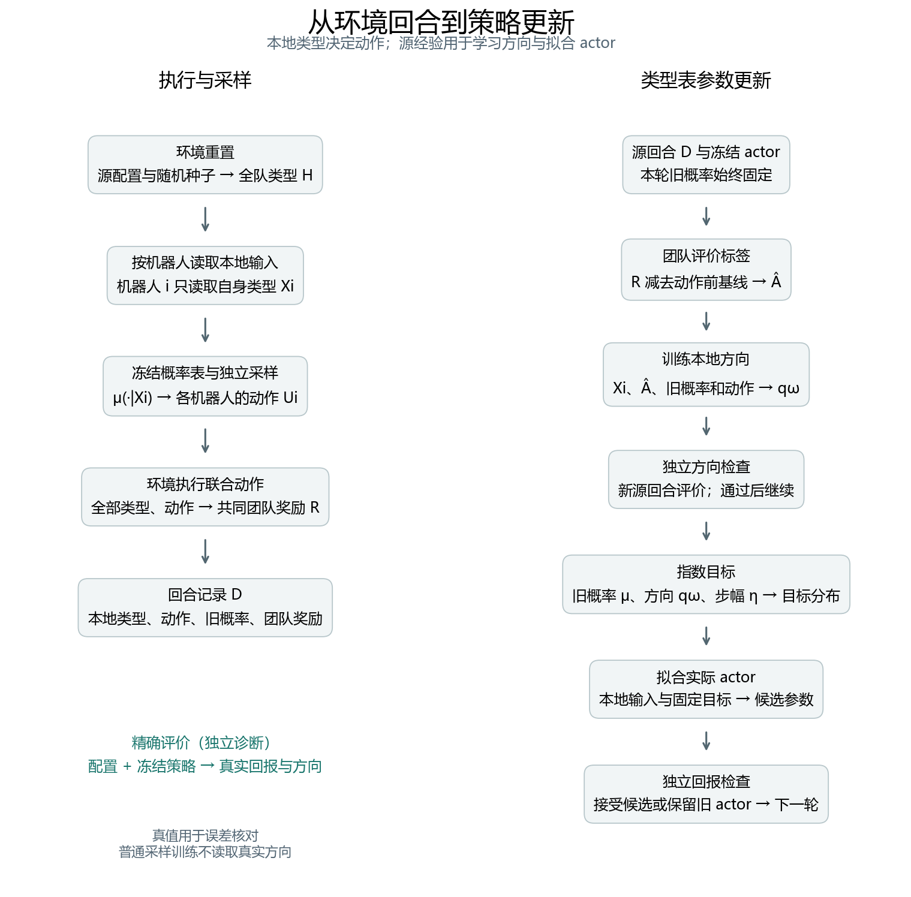

# pair_coordination 模块说明

阅读环境规则与计分例子请先看[设计文档](设计文档.md)。本文件解释软件中每一部分负责什么、接收什么、交给谁，以及哪些功能仍需实现。运行命令集中在 [README](README.md)。

## 1. 模块之间怎样连接

环境负责产生类型和计算团队奖励；actor 根据类型产生动作概率；收集器把二者连起来，形成经验。训练程序随后使用经验学习调整方向，将调整转为目标概率，再拟合 actor。

左右两侧均已接入 MLP 与类型表训练。精确评价器提供核对用的真实量，训练梯度和接受决定使用源样本。

文中使用三个参数名称：actor 参数为 $\theta$，方向函数参数为 $\omega$，critic 参数为 $\psi$。它们属于不同模块，不由同一次损失同时更新。$\mu$ 表示一轮训练开始时冻结的 actor 概率，$q_\omega$ 表示候选调整方向。

## 2. 已实现模块

### 2.1 环境配置：规定游戏规则

**代码：** [pair_coordination.py](envs/pair_coordination.py) 中的 `PairConfig`；默认配置为 [pair_source.json](configs/pair_source.json)。

- 输入：人数、类型分布、个人偏好表、类型交互表及交互强度。
- 输出：通过检查的环境配置对象。
- 调用方：环境、收集器和精确评价器。

配置检查人数不少于 2、类型概率非负且和为 1、奖励参数有限、交互表对称等条件。`reward_bound` 给出共同奖励的绝对上界，供后续统计检查使用。

环境配置固定规则。后续学习率、网络宽度、训练次数属于训练配置，应单独保存。

### 2.2 环境：抽取类型并给联合动作计分

**代码：** [pair_coordination.py](envs/pair_coordination.py) 中的 `PairCoordinationEnv`。

| 接口 | 输入 | 输出与用途 |
|---|---|---|
| `reset()` | 可选随机种子 | 抽取本回合全队类型，返回按机器人存放的本地观测 |
| `reset(types=...)` | 人为指定类型 | 复现计分例子和测试，带诊断标记 |
| `step(actions)` | 每个机器人一个动作编号 | 一个共同奖励、终止标记及类型副本 |
| `state()` | 无额外输入 | 当前全队类型副本，用于集中记录或评价 |
| `reward(types, actions)` | 明确的类型和动作 | 计算这一事件的奖励，不推进环境 |
| `reward_batch(...)` | 同一类型组合与多组联合动作 | 批量奖励，供枚举评价使用 |

动作编号为 0/1，对应设计文档中的 A/B。执行一次 step 后回合结束，再次 step 会报错，必须先 reset。环境返回类型向量是为了批量收集；actor 一次调用只能接收对应的一个类型。

### 2.3 固定策略校验与采样：产生一批源经验

**代码：** 同文件中的 `validate_policy`、`sample_episodes`。

收集器接收源配置、形状为 `(类型数, 2)` 的冻结概率表、回合数和种子。它反复重置环境、按每个机器人的自身类型查概率、独立采样动作、执行联合动作并记录奖励。

概率表必须严格为正，且每行和为 1。收集器复制概率表，后续调用者修改原数组不会改变已保存的旧概率。类型采样和动作采样使用独立随机流。

| 返回字段 | 形状 | 后续消费者 |
|---|---|---|
| `local_types` | `(N,n)` | actor、方向函数；整行只可供集中模块使用 |
| `actions` | `(N,n)` | 构造每个机器人的动作学习信号 |
| `old_probs` | `(N,n,2)` | score、Fisher 与目标构造 |
| `team_rewards` | `(N,)` | 标签模块 |
| `weights` | `(N,n)` | 归一化损失，每项为 `1/(N*n)` |

$N$ 是回合数，$n$ 是人数。这里没有时间轴，因为一个回合仅有一步。后续多轮训练需另外保存回合标识、冻结快照标识和数据用途。

### 2.4 精确评价：计算可用于核对的真实量

**代码：** [exact_pair.py](evaluation/exact_pair.py) 中的 `exact_evaluate`。

- 输入：环境配置、冻结概率表，以及可选的零和方向表。
- 处理：枚举所有正概率类型组合及联合动作，按事件概率加权。
- 输出：真实平均回报、当前本地方向及候选方向误差等量。
- 消费者：数学测试、诊断日志和实验分析。

常用结果字段：

| 字段 | 含义 |
|---|---|
| `expected_return` | 指定策略在该环境中的真实平均团队得分 |
| `local_direction` | 每个类型在当前策略处的真实局部改进方向 |
| `direction_error` | 候选方向与真实本地方向的 Fisher 加权差距 |
| `score` | 候选方向的总体变分分数 |
| `information_gap` | 完整信息参考方向与本地方向之间的一阶信息差距 |
| `return_derivative` | 指定方向处的团队回报一阶导数，包含人数因子 |
| `supported_types` | 哪些类型在当前环境分布中有正概率 |

未传方向时，评价器以零方向计算相应指标。零概率类型的方向数组填零，只作为存储约定。

默认最多枚举 100 万个事件。两类型、8 人时需要 65536 个事件。超过上限会报错，避免无意进行过大的穷举。

### 2.5 解析方向核对：给枚举结果提供另一种计算方式

**代码：** 同文件中的 `closed_form_local_direction`。

输入为配置和冻结策略。它利用独立类型及完全图结构直接计算真实方向，用于核对枚举结果。

具体地，类型 $y$ 的平均行为值为 $\overline a_y=\mu(1\mid y)-\mu(0\mid y)$。对于当前类型 $x$，有效奖励系数为

$$
g(x)=b_x+\rho\sum_y p_yc_{xy}\overline a_y,
\qquad v^{\mathrm{loc}}(x)=(-g(x),g(x)).
$$

$g(x)>0$ 表示相对增加 B 的偏好有利。这个公式依赖当前环境的特定结构，不能直接用于其他交互图或相关类型分布。它属于精确诊断，不是已学得的方向网络。

### 2.6 指数目标：把旧概率与候选方向组合起来

**代码：** 同文件中的 `exponential_target`。

- 输入：冻结概率 $\mu$、同形状方向 $q$、步幅 $\eta$。
- 输出：归一化目标概率。
- 消费者：数学演示和 `training/actor_fit.py` 的 actor 拟合器。

$$
\widetilde\mu_\eta(u\mid x)
=\frac{\mu(u\mid x)\exp(\eta q_u(x))}
{\sum_v\mu(v\mid x)\exp(\eta q_v(x))}.
$$

例如，类型 0 的方向为 `(0.1, -0.1)` 时，正步幅会相对增加 A 的概率。实际变化幅度还取决于旧概率与步幅。函数检查数值溢出和概率下溢，出现问题要求缩小更新。

该函数生成概率数组。PyTorch 拟合器将数组转换为所选设备上的固定标签张量，通过自动微分和 Adam 更新 actor 参数。

### 2.7 演示、可视化和测试：展示并核对实现

| 文件 | 功能 | 当前输出 |
|---|---|---|
| [run_experiments.py](run_experiments.py) | 串联训练比较与机制核验 | 按实验编号输出 CSV 和单张总览 |
| [visualization/render.py](visualization/render.py) | 分解一个回合的奖励并绘图 | 单回合奖励图与数据流图，SVG/PNG |
| [test_pair_coordination.py](tests/test_pair_coordination.py) | 检查采样、计分和数学结果 | 19 项环境与理论测试 |
| [test_visualization.py](tests/test_visualization.py) | 核对绘图贡献之和与环境奖励 | 3 项可视化数据测试 |

默认图中的具体类型和动作是人为指定的解释例子，图中得分由环境公式计算。analysis/plot_training.py 读取实际训练日志，默认生成单张总览；详细分图按需启用。tests/ 包含环境、学习、检查、恢复、套件协议和统一日志的验证，具体数量以当前测试输出为准。

## 3. 学习模块

本节各模块已接入 PyTorch 训练。`models/torch_models.py` 提供训练模型，`training/torch_fit.py` 计算损失并通过自动微分和 Adam 更新参数；`--device` 选择 CPU/CUDA。`train.py` 提供固定数据方向学习、多轮策略学习和批量比较入口。默认 actor 与方向函数为 MLP，可分别选择类型表。以下 NumPy 模型负责公共初始化、旧权重读取和数值核验，训练入口将其权重导入 PyTorch 模型。

### 3.1 actor：实际执行决策

**代码：** `models/actor.py` 的 `TableActor`；`models/mlp.py` 的 `MLPActor`。后者将本地类型转为独热向量，经可配置的 tanh 隐藏层输出一个 logit。各层权重均参与更新；采样接口接收前向计算得到的概率表。

输入是本地类型索引，输出是 A、B 的概率。类型表为每种类型保存一个 logit，MLP 则由网络计算 logit。B 的概率为 `beta/2 + (1-beta)*sigmoid(logit)`，A 为补数；默认 beta=0.02。完整训练通过 PyTorch 自动微分更新参数，NumPy 类型表保留解析梯度供机制核验。所有机器人共享本地策略。

actor 参数 $\theta$ 在目标拟合时更新。最终部署只读取本地类型并调用 actor。概率下限、保存加载、冻结副本均由本模块明确处理。

### 3.2 方向函数：学习当前策略的调整

**代码：** `models/direction.py` 的 `TableDirection`；`models/mlp.py` 的 `MLPDirection`。MLP 读取同一本地类型的独热向量，输出标量，再按下面的零和有界结构构造方向。初始输出为零，随后训练全部网络层。

输入仍然是单个类型，输出两个方向分量。首先为每个类型学习标量 $t_x$，返回 $q(x)=(-t_x,t_x)$，保证分量和为零。正的 $t_x$ 倾向增加 B，负的 $t_x$ 倾向增加 A。

实现采用 $t_x=Q_{\max}\tanh(w_x)$，输出有明确幅度上限。日志中的 `amplitude_fraction` 记录最大输出幅度占上限的比例。方向函数更新 $\omega$，采样 actor 在这一阶段冻结。

### 3.3 标签与可选 critic：给动作提供团队评价

**代码：** `training/labels.py`、`models/critic.py`。默认 `--baseline zero`；`--baseline table` 为每个全队类型组合拟合平均回报，使用单独的源批次并裁剪到奖励界内。未观测的组合使用零值。

最初可使用零基线，标签就是采到的共同奖励 $R_j$。加入 critic 后，它读取动作前全队类型 $H_j$，估计本回合通常能得到多少分，再构造标签 $\widehat A_j=R_j-V_\psi(H_j)$。

一个回合的标签为一个数，会广播给该回合全部机器人；各自的实际动作与旧概率会把共同标签转成不同更新信号。

当前 critic 使用单独的源数据拟合后冻结，尚未实现按回合交叉拟合。评价批次产生前固定基线。P-M1 的精确优势 R−E[R|联合类型] 属于独立机制条件，与普通采样回报标签分开记录。

### 3.4 方向损失：根据源样本更新方向函数

**代码：** training/direction_loss.py 定义两种损失及分派；完整训练由 training/torch_fit.py 使用 PyTorch Adam，表格机制实验使用 training/optim.py 的 NumPy Adam。

输入包括类型、实际动作、旧概率、固定标签及当前方向输出。对一条记录，先计算

$$
S=e_U-\boldsymbol\mu_x,\qquad
F=\operatorname{Diag}(\boldsymbol\mu_x)-\boldsymbol\mu_x\boldsymbol\mu_x^\top.
$$

$e_U$ 是实际动作的独热向量，$S$ 将团队评价与该机器人的动作联系起来。实现两个损失：

$$
\widehat L_{\mathrm{an}}=\frac1{Nn}\sum_{j,i}
\left[q_{j,i}^\top F_{j,i}q_{j,i}
-2\widehat A_jS_{j,i}^\top q_{j,i}\right],
$$

$$
\widehat L_{\mathrm{sample}}=\frac1{Nn}\sum_{j,i}
\left[(S_{j,i}^\top q_{j,i})^2
-2\widehat A_jS_{j,i}^\top q_{j,i}\right].
$$

两者的线性项相同，二次项的经验计算不同。损失只向 $\omega$ 传播梯度。旧概率、score 与标签保持固定，不接受本次更新。

总体分数越接近真实本地方向的能量，方向误差越小。该分数不是团队回报数值下界，actor 的实际得分仍要另行评价。

### 3.5 actor 拟合：把目标概率变为可执行模型

**代码：** `training/actor_fit.py`。按训练批次中类型的频率加权，使用 Adam 拟合固定目标。

输入为固定目标概率、本地类型及旧 actor 副本。最小化目标到候选 actor 的前向 KL：

$$
\widehat L_{\mathrm{fit}}(\theta)=\frac1{Nn}\sum_{j,i}
D_{\mathrm{KL}}[\widetilde\mu_\eta(\cdot\mid X_{j,i})
\Vert\pi_\theta(\cdot\mid X_{j,i})].
$$

输出为候选 actor 参数和拟合记录。每个候选步幅从同一个旧 actor 副本重新开始；目标固定，梯度仅更新 $\theta$。

记录经验拟合 KL 和精确评价中的真实回报。平均 KL 只描述相应输入分布，不直接等于理论中的全历史一致误差。

### 3.6 接受检查：决定是否采用候选

**代码：** training/acceptance.py。hoeffding 以下界大于零为接受条件，每次检查分配 `alpha / (rounds * (1 + attempts))` 的错误概率预算。当前 train_minibatch 和套件配置使用 empirical，只判断样本均值大于零，没有同样的置信保证。TrainConfig 的底层默认值及旧 train_mlp 配置仍为 hoeffding，不能与所选配置混为一谈。

方向检查在候选方向冻结后，生成独立源回合，判断方向分数是否满足条件。回报检查在候选 actor 冻结后，比较候选与旧 actor 的独立源回报。

检查模块输出估计值、置信半径、阈值、回合成本及接受决定。它不修改网络。置信规则需要方向有界、有效奖励界和重复检验预算；基线如参与有界标签构造，也需要有界输出。

默认奖励界为 2.6。若基线限制在 [−2.6, 2.6]，标签绝对值可用 5.2 控制。检查不足以确认改进时，保留旧 actor 并记录原因。经验筛选变体需要单独标记其统计保证。

### 3.7 训练控制器：按顺序调用上述模块

**代码：** `train.py`、`training/config.py` 和 `training/runner.py`。`direction` 模式执行一轮固定数据方向学习；`policy` 模式执行多轮接受检查与 actor 更新。

控制器读取一个源配置与训练配置，决定样本数量、优化预算、候选步幅和停止条件。每轮依次执行冻结 actor、源采样、标签、方向训练、方向检查、目标构造、actor 拟合和回报检查。

完整方向方法只有检查接受后才提交新 actor；去检查变体按开关跳过相应采样与筛选。PG 使用 training/policy_gradient.py，每批新数据只做一次 on-policy Adam 更新并跨轮保存优化器状态，不执行方向学习和接受检查。方向运输必须将方向与其参考 actor 配对；完整模型快照仅在开启 save_direction_snapshots 时保存，机制套件另在 CSV 中保存运输所需的表格参数。

### 3.8 日志与训练曲线：显示实际学习过程

**代码：** training/logging.py、analysis/plot_training.py、experiments/reporting.py。默认记录每批用途、种子、采样策略和累计成本；完整样本及唯一回合编号仅在 save_batches 开启时写入 NPZ。套件每个成功子运行只保存 4 个 JSON 与 1 个 events.jsonl，逐类记录以 stream/record 包装；单次 train.py 保留原调试布局。统计与绘图兼容两种布局。

日志接收逐次更新或逐轮统计，保存到本环境的 `results/<run_id>/`。绘图程序读取这些文件生成曲线，不重新执行训练或选择模型。

| 实验阶段 | 曲线 | 横轴 |
|---|---|---|
| 固定数据方向学习 | 训练损失、真实方向误差、总体分数 | 梯度更新次数 |
| 有限样本比较 | 独立重复下的方向误差均值与区间 | 源回合数 |
| actor 拟合 | 前向 KL、目标与实际 actor 的回报变化 | 拟合次数或候选步幅 |
| 多轮源学习 | 源回报、更新接受率、各项交互成本 | 累计源团队步数 |

日志同时保存配置、随机种子、快照标识、标签方式和依赖版本。所有检查回合计入源预算。真实量用于诊断，不自动参与停止和候选选择。

### 3.9 冻结模型评价：完成规模变化实验

**代码：** evaluate.py。优先读取 checkpoints/final.json，通过 --n-agents 或 --config 指定冻结评价环境；兼容旧 actor.json。方向运输也可读取启用快照后生成的配对 round_*.json，P-M3 则直接复用 P-M1 的源表格方向。

加载冻结 actor 和输入规则，再执行预先规定的目标配置。评价关闭参数更新，输出团队回报及每机器人回报。单轮方向运输使用成对保存的冻结 actor 和该轮方向，不能替换成最终 actor 后继续沿用旧方向指标。

源训练不读取目标评价结果。按目标回报修改方法后，需要明确新开发轮次并安排独立目标评价。

## 4. 一个训练批次如何经过这些模块

以 4 人、256 回合的说明性批次为例（当前常用配置采集 1024 回合）：

1. 收集器产生 `(256,4)` 类型和动作，`(256,4,2)` 旧概率，以及 256 个团队奖励。
2. 标签模块产生 256 个评价值，再广播到各回合的 4 个机器人。
3. 方向函数输出 `(256,4,2)` 的候选调整；方向损失归一化到 1024 条机器人记录，但保留回合分组。
4. 优化器只更新方向参数。若这是固定数据实验，就在此记录方向误差和曲线。
5. 完整训练继续进行独立方向检查，检查回合额外采集并计入预算。
6. 接受方向后，目标构造器产生两动作目标概率；拟合器更新候选 actor。
7. 冻结候选并另采源回合做回报检查，控制器根据结果接受或保留旧 actor。

`direction` 模式执行前四步，`policy` 模式继续执行后三步。可选集中 critic 使用每轮额外采集的独立源批次，在构造标签前完成拟合并冻结。

## 5. 模块共同遵守的信息约定

- actor 和方向函数只读取自身类型；集中评价读取全队类型。
- 源类型采样和动作采样的概率是两个不同对象，分别由环境与 actor 决定。
- 同一轮的旧概率、Fisher、标签和方向指标绑定同一个冻结 actor。
- 一个回合内机器人记录相关，数据划分和不确定性估计按回合分组。
- 当前为一步任务，回报等于一步奖励；回报导数包含人数因子。
- 所有正式训练配置分别执行单源学习，目标规模只在冻结评价中出现。

## 6. 待办与完成标准

### 第一阶段：可以训练方向并看曲线

- [x] 训练配置：种子、源样本数、标签方式、方向上限和优化预算。
- [x] 有界可训练方向表。
- [x] 采样回报标签和两种方向损失。
- [x] 固定数据训练入口及模型保存。
- [x] 损失、真实方向误差、分数日志与曲线。
- [x] 梯度、冻结数据、参数更新范围和复现测试。

完成标准：同一数据和初始化下可运行两种损失，生成日志与曲线，相关数值核验和回归测试通过。

### 第二阶段：可以逐轮改善实际策略

- [x] 生效配置与启动计划、两个实际学习率、预算预估。
- [x] 更新级梯度范数、epoch 级拟合指标、阶段耗时与源成本。
- [x] 正常停止原因及异常阶段报告，记录已采集但未提交的回合成本。

- [x] 按完整 episode 打乱及小批次训练，独立配置采集量与 epoch 数。
- [x] 逐轮更新 final、按执行策略回报保存 best；完成轮次边界恢复，PG 同时恢复 Adam 状态。
- [ ] 未完成轮次中的优化器与梯度进度恢复。

- [x] 可训练 actor、目标拟合和快照管理。
- [x] 集中 critic 及独立标签数据安排。
- [x] 独立方向、回报检查和重复检验预算。
- [x] 多轮控制器、总源预算及回报曲线。

完成标准：目标概率、拟合误差、实际回报及接受成本均可追溯。

### 第三阶段：可以进行正式比较

- [x] 独立的偏好冲突、二阶边界及组成变化配置。
- [x] MLP actor 与方向函数；命令行配置隐藏宽度、深度与模型类型。
- [x] PG 直接策略更新对照及 P-C/P-A 六种训练条件。
- [x] P-M2 自由表格与共享单 logit 的目标实现和容量机制核验。
- [x] P-M1/P-M3/P-M4/P-H、配对方向误差区间和检查比例 Wilson 区间。
- [x] 多样本量、多种子批量运行及均值、标准差统计。
- [x] 冻结 actor 与配对方向的目标评价入口。
- [x] 批量结果曲线。
- [x] pilot 及后续开发实验；已有结果见[结果目录索引](results/结果目录索引.md)。
- [x] 三份论文补充配置与可运行命令，见[运行说明](论文补充实验运行说明.md)。
- [ ] 执行并分析独立种子的论文确认实验，整理依赖锁定信息。

完成标准：按[实验方案](../../docs/策略流形研究设计.实验方案.md)统一输入、容量与源预算，报告独立重复及失败结果。
