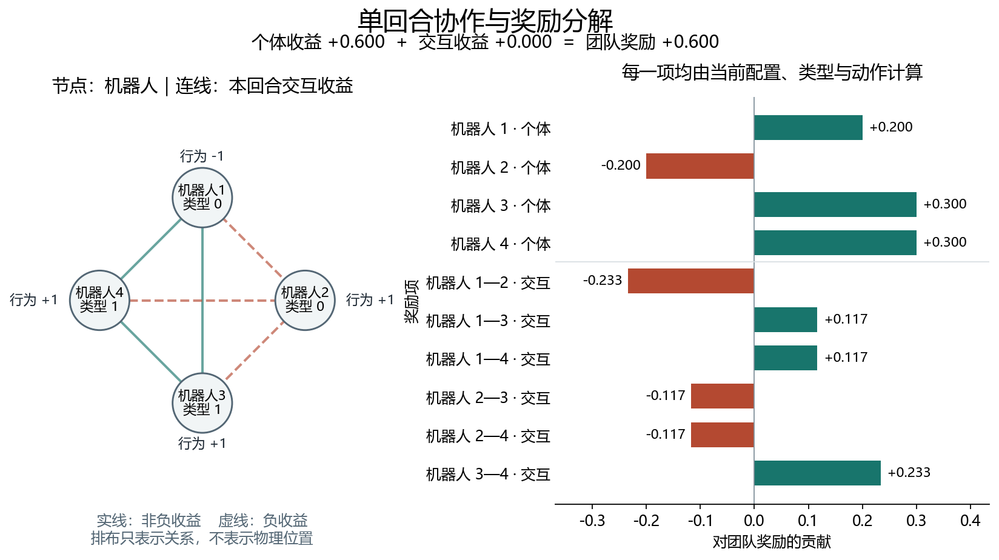

# 环境设计：多人选择 A 或 B 的协作任务

## 1. 这个环境在做什么

把这个环境看成一个四人计分游戏：每个人拿到一个类型，只看自己的类型，然后同时选择 A 或 B。全部选择提交后，环境按固定规则算出一个团队总分，本回合结束。

代码把这四个参与者称为机器人。当前程序模拟的是选择与收益关系，没有仓库地图、移动轨迹或物理装卸过程。图中机器人的圆形排布只用来展示谁和谁有交互。

**学习任务是：让每个参与者根据自己的类型决定选择 A、B 的概率，使很多回合的平均团队得分提高。**

这里的 A、B 是两种抽象选择，没有附带路径规划、目标分配或具体业务操作。正文用 A、B 解释任务，代码用整数 0、1 提交动作。

## 2. 先认识四个基本对象

### 2.1 类型：本回合你属于哪一类

默认有类型 0 和类型 1。类型影响两件事：你选择 A、B 时的个人贡献，以及你与其他人选择相同或不同动作时的交互贡献。

每个回合，环境为每个参与者独立抽取类型：抽到类型 0 的概率为 0.6，类型 1 为 0.4。因此，一回合可能出现两个 0、两个 1，也可能全部都是同一种类型。

类型是本回合的观测，不是机器人编号。机器人 1 在下一回合可以拿到不同类型。下面用固定类型举例，仅用于解释一次计分；正式源采样仍按给定概率抽取。

### 2.2 动作：每个人只选一次

| 正文名称 | 提交给代码的编号 | 奖励公式里的数值 |
|---|---|---|
| A | 0 | −1 |
| B | 1 | +1 |

奖励公式用 −1、+1，是因为相同选择的乘积等于 +1，不同选择的乘积等于 −1。这种编码方便计算两两配合的收益，不代表动作的好坏。

### 2.3 观测：每个人只看到自己的类型

如果全队类型是 [0, 0, 1, 1]：

- 机器人 1 看到 0。
- 机器人 2 看到 0。
- 机器人 3 看到 1。
- 机器人 4 看到 1。

机器人看不到其他人本回合拿到了什么类型，也看不到其他人的当前动作。训练收集器保存全队记录，是为了计算奖励和集中评价；执行策略的一次调用只接收自己的类型。

### 2.4 团队得分：所有人共同承担结果

环境把个人贡献和两两交互贡献相加，返回一个共同团队奖励。学习算法评价整支团队的表现。

下文的“个人贡献”是计算团队总分的一个组成部分，环境接口不会把它作为各机器人独立优化的奖励。默认采样批次只保存总分。

## 3. 默认计分规则

当前配置见 [pair_source.json](configs/pair_source.json)。默认有 4 人，任意两人之间都有交互。

### 3.1 先计算每个人自己的贡献

| 你的类型 | 选择 A | 选择 B |
|---|---:|---:|
| 类型 0 | +0.2 | −0.2 |
| 类型 1 | −0.3 | +0.3 |

例如，类型 0 选择 A，会给团队贡献 +0.2。只看这一项，类型 0 偏好 A，类型 1 偏好 B。

### 3.2 再计算每一对人的贡献

4 人共有 6 对组合。每对只计算一次：1—2、1—3、1—4、2—3、2—4、3—4。

在当前 4 人配置下，每一对的交互贡献如下：

| 两个人的类型关系 | 两人选择相同 | 两人选择不同 |
|---|---:|---:|
| 同类型 | +0.23333… | −0.23333… |
| 不同类型 | −0.11666… | +0.11666… |

因此，同类型的两个人采用相同选择会加分；不同类型的两个人采用不同选择会加分。这里的系数已经包含默认交互强度 0.7 和人数归一化因子 1/3。

### 3.3 一个回合完整算下来

假设类型和选择如下：

| 机器人 | 类型 | 选择 | 个人贡献 |
|---|---:|---|---:|
| 1 | 0 | A | +0.2 |
| 2 | 0 | A | +0.2 |
| 3 | 1 | B | +0.3 |
| 4 | 1 | B | +0.3 |

个人贡献合计为 1.0。

机器人 1—2、3—4 是同类型且同选择，各加 0.23333…。其余四对是不同类型且不同选择，各加 0.11666…。交互贡献合计约为 0.93333。

所以，这个回合的团队奖励为：

$$
1.0+0.93333\ldots=1.93333\ldots
$$

### 3.4 一个人改变选择，会影响哪些地方

保持上述类型不变，只让机器人 2 从 A 改选 B：

| 变化项 | 改变前 | 改变后 | 团队得分变化 |
|---|---:|---:|---:|
| 机器人 2 的个人贡献 | +0.2 | −0.2 | −0.4 |
| 机器人 1—2 的交互 | +0.23333… | −0.23333… | −0.46666… |
| 机器人 2—3 的交互 | +0.11666… | −0.11666… | −0.23333… |
| 机器人 2—4 的交互 | +0.11666… | −0.11666… | −0.23333… |

其他贡献保持原值。最终个人贡献为 0.6，交互贡献恰好相互抵消，总分变为 0.6。

这就是环境中的协作关系：一个人的选择不仅改变自己的贡献，还会改变它与其他人的成对贡献。

图中的行为 −1 对应 A，+1 对应 B。右侧数值逐项对应环境的计分结果；左侧连线表示本回合交互贡献的正负。

## 4. 程序实际运行的一次回合

当前可以通过以下代码指定类型，复现第 3.3 节的例子：

~~~python
from manifold_project.experiments.pair_coordination.envs.pair_coordination import (
    PairCoordinationEnv,
)

env = PairCoordinationEnv()
local_types, info = env.reset(types=[0, 0, 1, 1])
next_obs, team_reward, terminated, truncated, info = env.step([0, 0, 1, 1])

# team_reward 约为 1.933333
# terminated 为 True，truncated 为 False
~~~

reset(types=...) 是诊断接口。普通源采样使用 reset()，让环境按类型分布抽取本回合的类型。

step 返回的 next_obs 是本回合类型的副本，方便接口处理。该回合已经结束；必须再次 reset() 才能开始下一回合。程序没有第二次动作或后续奖励。

## 5. 学习算法究竟要学什么

### 5.1 actor 学习选择概率

actor 是执行策略的函数。默认演示把它写成一张固定表：

| 看到的类型 | 选择 A 的概率 | 选择 B 的概率 |
|---|---:|---:|
| 0 | 0.65 | 0.35 |
| 1 | 0.35 | 0.65 |

例如，类型 0 的机器人以 65% 的概率选择 A。所有机器人使用同一张表；相同类型得到相同概率，但各自独立采样，实际动作可以不同。

当前训练更新输出这张概率表的类型 logit 参数。环境规则由环境代码持有，样本学习通过类型、动作和团队奖励获得反馈。

### 5.2 方向函数学习概率该如何调整

方向函数回答：在当前 actor 附近，遇到类型 0 或 1 时，应当相对增加哪个动作的偏好，增加多少？

它先根据源回合学习调整，再与旧概率组合成目标概率。actor 拟合该目标后，实际选择概率才发生变化。

一次方向训练可以保持 actor 完全固定。这个阶段只能观察方向是否学准，还不能期待采样 actor 的回报不断提高。

### 5.3 用什么标准判断学得准确

因为这个任务很小，评价程序可以穷举所有类型组合和动作组合，计算当前策略的真实平均得分与真实本地方向。

默认 4 人、2 类型有 16 种类型组合，每种有 16 种动作组合，共 256 个事件。程序按各事件的发生概率求加权平均。

真实量用于核对学习误差。套件 P-M2 用精确方向核验小步目标与 actor 实现；train.py 使用样本学习方向，并单独记录与真实方向的差距。旧 run_demo.py 已不在当前代码中。

## 6. 默认任务有多难

默认配置中，类型 0 选择 A、类型 1 选择 B，会同时满足所有个人偏好和两两交互偏好。它的最优选择关系很直接，适合验证实现、样本误差和更新过程。

偏好冲突配置已提供：保留类型 0 偏好 A、类型 1 偏好 B，但让所有人之间都因选择相同而加分。此时，类型不同的机器人会面临个人贡献与交互贡献之间的取舍。

这一冲突配置保存在 `configs/pair_conflict.json`。各配置分别建立自己的单源任务，不在一次训练中轮换奖励规则。

当前 run_experiments.py 套件固定使用 pair_source.json，尚不把冲突配置列入其 P-C/P-A 网格；需要研究冲突环境时另用 train.py 指定源配置，不能把现有源任务结果当成冲突任务结果。

二阶协作测试则使用两人、单类型、相同选择得 +1、不同选择得 −1。均匀随机策略处的一阶信号为零，但两人同时提高同一动作的概率可以增加得分，用于观察算法边界。

## 7. 第一个环境怎样安排实验

| 阶段 | 固定什么 | 学习或改变什么 | 观察什么 |
|---|---|---|---|
| 方向学习 | 源环境、actor 和一批样本 | 两种方向损失分别更新方向函数 | 训练损失、真实方向误差、方向分数 |
| actor 实现 | 冻结 actor、候选方向 | 目标步幅、actor 拟合预算或容量 | 目标得分、拟合误差、实际 actor 得分 |
| 多轮源学习 | 单个源环境及其重置规则 | 方向、目标和 actor 逐轮更新 | 平均团队回报、接受率、总样本成本 |
| 冻结后评价 | 训练完的 actor 或成对保存的 actor 与方向 | 目标人数、目标类型组成 | 目标回报和方向变化 |

论文补充配置 suite_paper_mechanisms.json 规定回合数 128、512、2048、8192，每个条件独立重复 20 个数据集；已完成的 pilot 仅使用前三个样本量和 3 个数据种子。解析 Fisher 与采样平方方案共用数据、标签、初始化、容量和更新预算，具体命令见[论文补充实验运行说明](论文补充实验运行说明.md)。

actor 容量比较从两个模型都能表示的共同基点开始。类型无关 actor 不能表示默认的两行不同概率表；该容量对照应采用共同均匀基点。仅仅共享网络参数不意味着这个小任务存在明显表达限制。

多轮源训练计入所有检查回合。目标评价在源训练冻结后执行，不使用目标回报选择训练轮次。比较规模时，分别报告团队总分和每机器人平均分。

静态环境图展示一个回合如何计分。训练后运行 `analysis.plot_training`，可查看方向损失、真实方向误差以及多轮实际 actor 回报。命令见 [README](README.md)，模块与后续待办见[模块说明](模块说明.md)。

当前开发结果表明，多种方法都能接近相同的约束最优回报；16 轮 Actor 拟合节省计算，检查机制尚未展示保护收益。解析项在部分冻结策略/标签条件下改善方向估计，但完整训练优势未得到支持。这里的定位是机制与边界分析，不能据此声称一般多步协作性能领先。数据与限定条件见[最新结果分析](results/后续三组实验分析_20260917.md)。

## 8. 与代码对应的数学定义

本节用于核对实现。前面的例子均使用下面同一套规则。

设机器人数量为 $n$，类型为 $X_i$，动作编号为 $U_i$，行为数值为 $a_i=2U_i-1$。类型独立抽取，类型 $x$ 的概率为 $p_x$。

$$
R(X,U)=\sum_i b_{X_i}a_i+
\frac{\rho}{n-1}\sum_{i<j}c_{X_iX_j}a_i a_j.
$$

| 公式变量 | 配置字段 | 默认值 |
|---|---|---|
| $n$ | n_agents | 4 |
| $p$ | type_probs | [0.6, 0.4] |
| $b$ | local_bias | [−0.2, 0.3] |
| $c$ | pair_payoff | [[1, −0.5], [−0.5, 1]] |
| $\rho$ | interaction_strength | 0.7 |

系数 $\rho/(n-1)$ 使每个机器人的名义交互权重总和为 $\rho$。它控制改变人数时单个机器人的交互尺度；团队奖励仍对全队求和。

当前实现限于独立类型、对称类型交互表和归一化完全图。修改人数和这些参数可通过配置完成，其他类型分布或交互图需要扩展环境和评价器。

单回合绝对奖励的确定性上界为：

$$
R_{\max}=n\max_x|b_x|+\frac{\rho n}{2}\max_{x,y}|c_{xy}|.
$$

默认上界为 2.6。它用于检查和估计范围，不是对策略性能的要求。算法中的分数、真实方向和统计检查定义见[模块说明](模块说明.md)，完整理论见[研究设计](../../docs/策略流形研究设计.CTDE本地策略改进版.md)。
